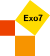

# exo7math/espanol-exo7

## Ejercicios

Aquí encontrarás cerca de 8000 ejercicios de matemáticas para la universidad, con algunas correcciones.
* [archivo pdf](ficall-espanol.pdf)
* [Fuente LaTeX](ficall-espanol.tex)
* [Imágenes](imágenes/)

## Fuente

Estos ejercicios fuente provienen del sitio [Exo7] (http://exo7.emath.fr) donde encontrará la lista de autores.

## Traducción

La traducción fue realizada por Jorge Poltronieri, profesor jubilado de la Universidad de Costa Rica.

## Exercices

Vous trouverez ici près de 8000 exercices de mathématiques pour l'université, avec quelques corrections.
* [Fichier pdf](ficall-espanol.pdf)
* [Source LaTeX](ficall-espanol.tex)
* [Images](images/)

## Origine

Ces exercices sources sont issus du site [Exo7](http://exo7.emath.fr) où vous trouverez la liste des auteurs.

## Traduction

La traduction a été effectuée par Jorge Poltronieri, professeur retraité de l'université du Costa Rica.

